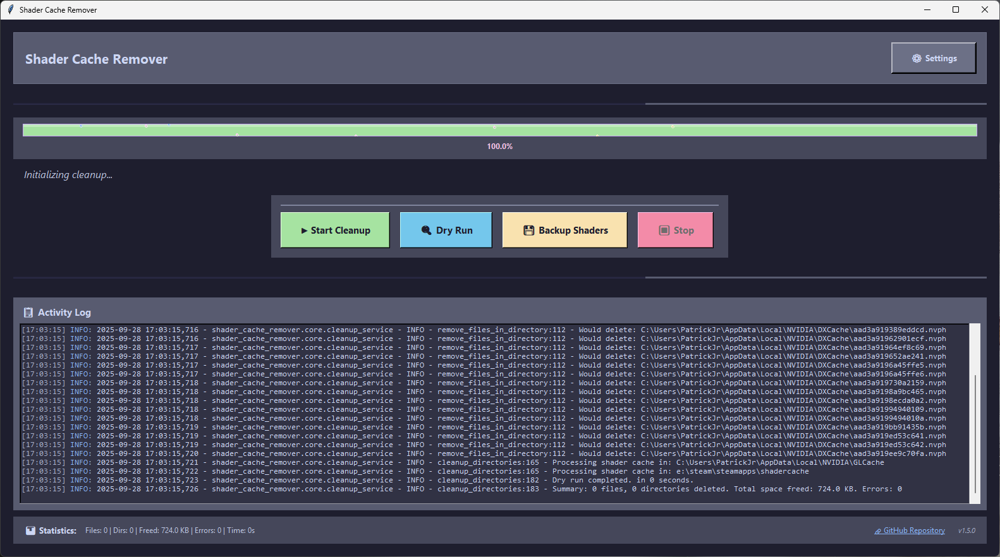

# Shader Cache Remover

A modular, clean architecture application for detecting and removing shader cache files from various applications and game engines.

## Overview

Shader Cache Remover is a powerful and user-friendly desktop application designed to clean up shader cache files from your system. Shader cache files are temporary files generated by graphics drivers (NVIDIA, AMD, Intel) and game engines (Unreal, Unity) to improve performance. Over time, these caches can become bloated, outdated, or corrupted, leading to wasted disk space and potential performance issues. This tool provides a safe and easy way to clear them out.

The application is built with Python and Tkinter and features a modern, dark-themed interface inspired by Catppuccin.

## 🚀 Key Features

- **Modern GUI**: An intuitive and visually appealing graphical user interface with a dark theme
- **One-Click Cleanup**: Safely delete shader cache files with a single click
- **Dry Run Mode**: Simulate a cleanup to see which files and directories would be removed without actually deleting anything
- **Backup System**: Automatically or manually back up shader caches to a location of your choice before deletion for easy recovery
- **Real-time Progress**: A live progress bar and status updates keep you informed during the cleanup process
- **Detailed Statistics**: Get real-time stats on files and directories deleted, total space freed, and any errors encountered
- **Comprehensive Scanning**: The tool automatically detects known cache locations for:
    - NVIDIA (DXCache, GLCache, NV_Cache)
    - AMD (DxCache, GLCache)
    - Intel
    - Steam
    - Unreal Engine
    - Unity
    - And other common Windows cache locations
- **Custom Path Support**: Easily add your own custom directories to be included in the cleanup scan via the Settings menu
- **Advanced Settings**: Configure auto-backups, detailed logging, and manage custom paths. All settings are saved automatically
- **Enhanced Logging**: A detailed log panel shows every action the application takes, with color-coded log levels for clarity
- **Stop Functionality**: Safely cancel an ongoing cleanup operation at any time

## 🖼️ Preview



## 🛠 Installation

### From Source
```bash
git clone https://github.com/PatrickJnr/Shader-Cache-Remover.git
cd Shader-Cache-Remover
```

### System Requirements
- Python 3.8 or higher
- Windows (primary support) or Unix-like systems
- Tkinter (usually included with Python)

### Running the Application

#### Option 1: Direct Execution
```bash
# From the repository root
python shader_cache_remover/main.py
```

#### Option 2: Original Script (still available)
```bash
# From the repository root
python remove_shader_cache.py
```

#### Option 3: Install as Package
```bash
cd shader_cache_remover
pip install -e .
shader-cache-remover
```

## 🎯 Usage

### 1. Choose an Action

- **Start Cleanup**: Click this to begin deleting all detected shader cache files. If auto-backup is enabled in Settings, a backup will be created first.
- **Dry Run**: Click this to perform a simulation. The log will show you everything that *would* be deleted, but your files will not be touched.
- **Backup Shaders**: Click this to create a one-time backup of all detected shader caches to a directory you specify.
- **Stop**: Click this button to safely interrupt any ongoing operation.

### 2. Configure Settings (Optional)

- Click the **Settings** button to open the configuration window.
- Here you can:
  - Enable or disable **auto-backups** before a cleanup.
  - Set a default **backup location**.
  - Add, edit, or remove **custom directories** to be scanned.
  - Toggle detailed logging and the progress bar visibility.
- Your settings are saved automatically when you click "Save Settings".

## ⚙️ Configuration

The application automatically creates a configuration file at:
- Windows: `%USERPROFILE%\.shader_cache_remover_config.json`
- Unix: `$HOME/.shader_cache_remover_config.json`

### Settings Include:
- Auto-backup before cleanup
- Custom shader cache paths
- Progress bar visibility
- Detailed logging level
- Backup location

## 🔍 Supported Cache Locations

### Automatic Detection
- **NVIDIA**: `AppData/Local/NVIDIA/DXCache` and `GLCache`
- **AMD**: `AppData/Local/AMD/DxCache` and `GLCache`
- **Intel**: `AppData/Local/Intel/ShaderCache`
- **Unity**: `AppData/LocalLow/Unity/Caches`
- **Unreal Engine**: `AppData/Local/UnrealEngine/ShaderCache`
- **Steam**: Registry-detected Steam shadercache directory

### Custom Paths
Users can add custom shader cache directories through the settings dialog.

## 🛡️ Safety Features

- **Dry Run Mode**: Preview all operations before execution
- **Backup Support**: Optional automatic backups with timestamps
- **Confirmation Dialogs**: User confirmation for critical operations
- **Error Recovery**: Graceful handling of file system errors
- **Progress Feedback**: Real-time status updates

## 📊 Statistics and Reporting

The application provides detailed statistics including:
- Files deleted
- Directories removed
- Space freed (human-readable format)
- Errors encountered
- Operation duration
- Backup status

## 🏗️ Architecture & Technical Details

### ✨ Modular Architecture
This version features a completely refactored modular architecture that improves upon the original monolithic script:

#### Architecture Improvements
- **Modular Design**: Clean separation of concerns with dedicated services
- **Better Maintainability**: Each component can be modified independently
- **Enhanced Testability**: Services can be unit tested in isolation
- **Improved Extensibility**: Easy to add new features or modify existing ones
- **Better Error Handling**: Comprehensive exception handling throughout

#### 📁 Project Structure
```
shader_cache_remover/
├── core/                    # Business logic services
│   ├── detection_service.py    # Finds shader cache directories
│   ├── cleanup_service.py      # Handles file removal & progress
│   └── backup_service.py       # Manages backup operations
├── infrastructure/          # Supporting services
│   ├── config_manager.py       # Configuration management
│   ├── registry_utils.py       # Windows registry operations
│   └── logging_config.py       # Centralized logging
├── gui/                     # User interface components
│   ├── main_window.py          # Main application window
│   └── settings_dialog.py      # Settings management dialog
├── main.py                  # Application entry point
└── setup.py                 # Package configuration
```

### Architecture Benefits
1. **Separation of Concerns**: Each module has a single responsibility
2. **Better Error Handling**: Comprehensive exception handling
3. **Enhanced Maintainability**: Type hints, proper documentation, clean code
4. **Improved Extensibility**: Easy to add new cache detection methods
5. **Testable Architecture**: Modular design enables unit testing

### Testing
Run the test suite to verify the modular architecture:
```bash
python shader_cache_remover/test_modular.py
```

## 📝 Important Notes

- **Administrative Privileges**: For best results, run the script with administrative privileges. This ensures it has the necessary permissions to access and delete system-level cache files.
- **Disk Space**: Be mindful of disk space if you use the backup feature, as shader caches can sometimes be several gigabytes in size.
- **Migration**: The new modular version is fully backward compatible with existing configurations.

## 🔄 Migration from Original

If you're migrating from the original monolithic script:
1. The new version is backward compatible in terms of functionality
2. Configuration is automatically migrated on first run
3. All existing features are preserved and enhanced
4. The modular structure provides better maintainability

## 🤝 Contributing

Contributions are welcome! The modular architecture makes it easy to:
1. Add new cache detection methods
2. Implement platform-specific optimizations
3. Enhance the user interface
4. Add new backup strategies
5. Improve error handling

## 📞 Support

For support, feature requests, or bug reports:
- Create an issue on GitHub
- Check the existing documentation
- Review the changelog for recent updates
